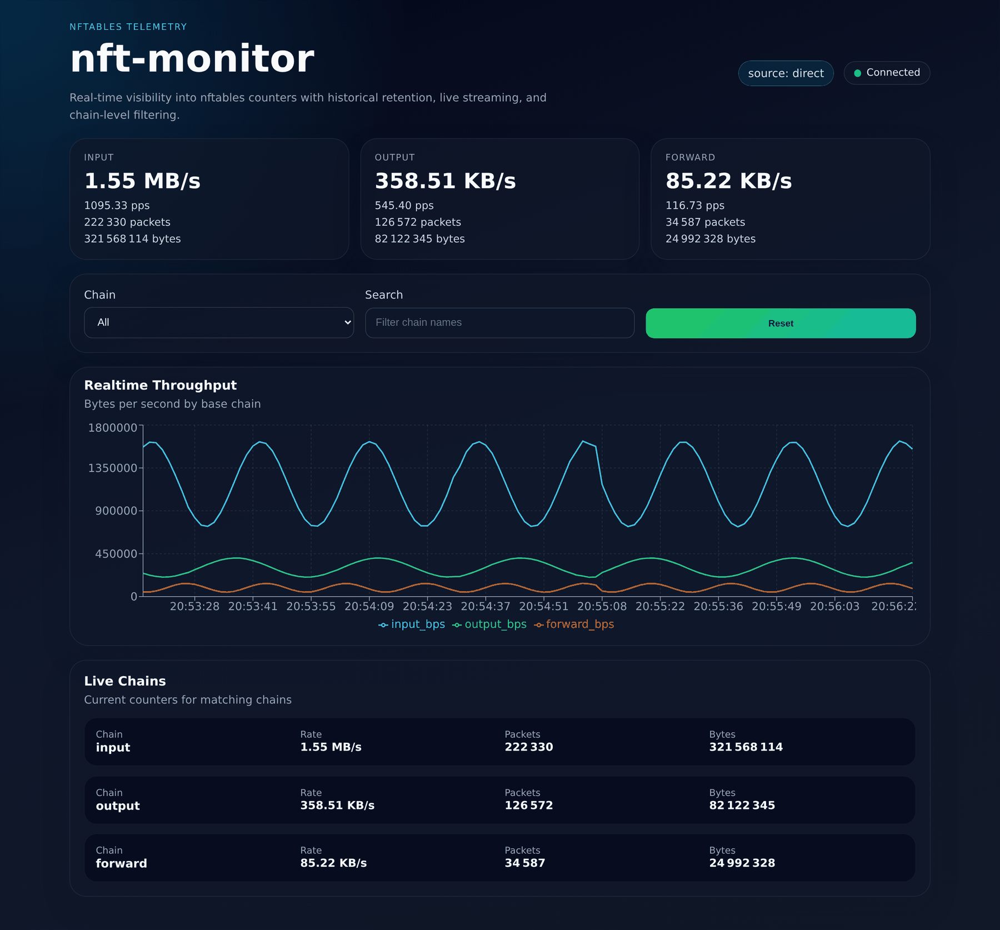
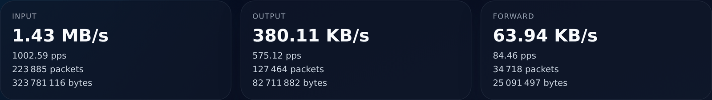
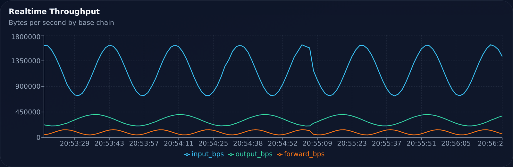
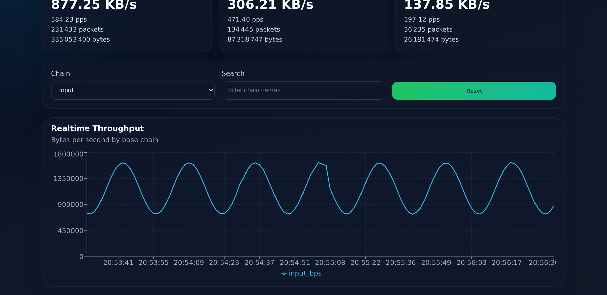
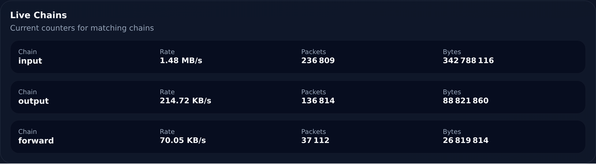
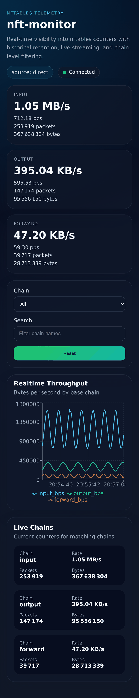
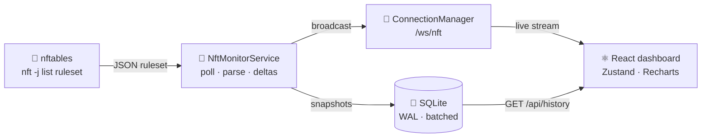

<div align="center">

# 🛡️ nft-monitor

**Real-time `nftables` telemetry — FastAPI backend, SQLite history, React dashboard over WebSocket.**

[](https://www.python.org/)
[](https://fastapi.tiangolo.com/)
[](https://react.dev/)
[](https://www.typescriptlang.org/)
[](https://vitejs.dev/)
[](https://www.sqlite.org/)

</div>

---

## 📸 Screenshots

### Dashboard

Live counters, throughput chart, and per-chain detail in a single view.



### ⚡ Headline stats

Per-chain rate, packet count, and byte count for `input`, `output`, and `forward`.



### 📈 Realtime throughput

Bytes per second per base chain, streamed over WebSocket with animations disabled for smooth updates.



### 🔍 Filtering

Narrow the view to a single chain, or search chain names — the chart and the table follow the filter.



### 📋 Live chains



### 📱 Responsive layout

<div align="center">
  
</div>

> [!NOTE]
> Screenshots were captured against a synthetic ruleset so the counters show sustained traffic.
> The backend, parsing, delta computation, storage, and streaming are the real ones.

---

## ✨ Features

| | Feature |
|:---:|---|
| 🔄 | Async `nft -j list ruleset` polling, no `shell=True` |
| 📊 | PPS and BPS rate calculation per chain |
| 💾 | SQLite history retention with WAL mode and batched writes |
| 🔌 | Live WebSocket stream with auto-reconnect on the client |
| 🕘 | REST history endpoint for backfilling the chart on load |
| 🎛️ | Chain filter, text search, and reset in the dashboard |
| 🛟 | `nft` errors are streamed as error snapshots instead of crashing the backend |
| 🔐 | Runs unprivileged via `CAP_NET_ADMIN` or a scoped `sudo` rule |

---

## 🧭 Architecture



---

## 📁 Repository Layout

```text
.
├── backend/
│   ├── main.py                 # FastAPI app, REST + WebSocket routes
│   ├── requirements.txt
│   ├── app/
│   │   ├── monitor.py          # polling loop, delta and rate computation
│   │   ├── database.py         # SQLite history, WAL, batched writes
│   │   ├── models.py           # pydantic contracts
│   │   ├── websocket.py        # connection manager and broadcast
│   │   └── utils.py            # nft execution and ruleset parsing
│   └── Dockerfile
├── frontend/
│   ├── index.html
│   ├── package.json
│   ├── vite.config.ts
│   ├── tsconfig.json
│   └── src/
│       ├── App.tsx
│       ├── main.tsx
│       ├── components/
│       │   ├── Chart.tsx
│       │   ├── Filters.tsx
│       │   └── StatusBadge.tsx
│       ├── hooks/
│       │   └── useWebSocket.ts
│       └── store/
│           └── useStore.ts
├── docs/screenshots/
├── README.md
├── AGENTS.md
└── CONTEXT.md
```

---

## ✅ Requirements

| Requirement | Version / Note |
|---|---|
| 🐍 Python | 3.11+ |
| 🟢 Node.js | 20+ |
| 🐧 `nft` | available on the host |
| 🔢 Counters | nftables rules must have counters enabled |

---

## 🚀 Installation

### 🐍 Backend

```bash
cd backend
python -m venv .venv
source .venv/bin/activate
pip install -r requirements.txt
```

### ⚛️ Frontend

```bash
cd frontend
npm install
```

---

## 🛠️ Development Mode

**Backend** — listens on `http://localhost:8000`

```bash
cd backend
uvicorn main:app --reload
```

**Frontend** — listens on `http://localhost:5173`

```bash
cd frontend
npm run dev
```

---

## 📦 Production Mode

**Backend**

```bash
cd backend
uvicorn main:app --host 0.0.0.0 --port 8000
```

**Frontend**

```bash
cd frontend
npm run build
npm run preview -- --host 0.0.0.0 --port 4173
```

<details>
<summary>🐳 <b>Backend Docker image</b></summary>

```bash
cd backend
docker build -t nft-monitor-backend .
docker run --rm -p 8000:8000 --cap-add=NET_ADMIN nft-monitor-backend
```

</details>

---

## 🔐 nft Permissions Setup

> [!IMPORTANT]
> The application does **not** require running the Python process as root.
> It first tries direct access to `nft`, then falls back to `sudo -n nft`.

<details open>
<summary><b>Option 1 — grant capability to <code>nft</code></b></summary>

```bash
sudo setcap cap_net_admin+ep "$(command -v nft)"
getcap "$(command -v nft)"
```

</details>

<details>
<summary><b>Option 2 — passwordless sudo, scoped to <code>nft</code> only</b></summary>

Create a sudoers drop-in:

```bash
sudo visudo -f /etc/sudoers.d/nft-monitor
```

Add:

```text
your-user ALL=(root) NOPASSWD: /usr/sbin/nft
```

Adjust the path if `command -v nft` returns a different location.

</details>

---

## 🔌 API

### WebSocket

| | |
|---|---|
| **Endpoint** | `ws://localhost:8000/ws/nft` |
| **Auth** | future placeholder — `?token=...` |

<details open>
<summary>📨 <b>Message shape</b></summary>

```json
{
  "type": "snapshot",
  "timestamp": "2026-04-09T12:00:00+00:00",
  "chains": {
    "input": {
      "chain": "input",
      "packets": 123,
      "bytes": 4567,
      "pps": 20.5,
      "bps": 8120.0
    }
  },
  "source_mode": "direct",
  "status": "ok",
  "error": null
}
```

</details>

### REST

| Method | Route | Description |
|---|---|---|
| `GET` | `/health` | Liveness probe |
| `GET` | `/api/history?hours=1` | Stored snapshots, `hours` between 1 and 168 |

---

## ⚙️ Environment Variables

### Frontend

| Variable | Default |
|---|---|
| `VITE_API_BASE_URL` | `http://localhost:8000` |
| `VITE_WS_URL` | `ws://localhost:8000/ws/nft` |
| `VITE_WS_TOKEN` | _(unset)_ |

---

## 🧪 Example Traffic Generation

Generate ingress/egress activity to produce visible counter changes:

```bash
ping -i 0.2 1.1.1.1
```

```bash
curl -L https://example.com --output /dev/null
```

```bash
iperf3 -c <server> -t 30
```

```bash
ab -n 1000 -c 20 http://127.0.0.1/
```

---

## 📝 Notes

- 🧠 The dashboard keeps the most recent **120 points** in memory.
- 🔗 Base-chain visibility depends on chain names in your ruleset. The UI is optimized for `input`, `output`, and `forward`.
- 🛟 The backend handles `nft` execution errors gracefully and streams error snapshots instead of crashing.
- 🔤 Chain names are normalized to lowercase.
